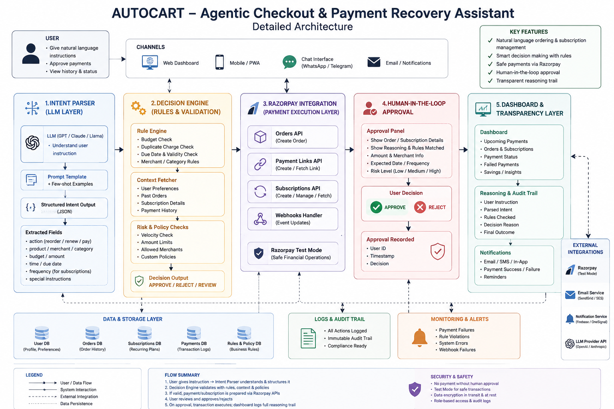

<div align="center">

# 🛒 AutoCart
### Agentic Checkout & Payment Recovery Assistant

Turn a plain-English instruction into a safely-approved, real payment. Explain every decision. Never move money without a human saying yes.

---


---

**AutoCart is a semi-autonomous commerce agent built for Razorpay's AI Growth & Agentic Commerce track. It parses a user's intent, validates it against budget and duplicate-payment rules, waits for explicit human approval, and only then executes a real Razorpay test-mode transaction — logging its full reasoning trail at every step.**

Problem Statement • Features • System Architecture • Repository Structure • Tech Stack • Components • Testing • Installation • Roadmap

</div>

---

- [🚨 Problem Statement](#problem-statement)
- [✨ Features](#features)
- [🏗️ System Architecture](#system-architecture)
- [📂 Repository Structure](#repository-structure)
- [⚙️ Tech Stack](#tech-stack)
- [🧩 Core Components](#core-components)
- [🔒 Security & Safety](#security-safety)
- [🧪 Testing](#testing)
- [▶️ Installation & Running Locally](#installation)
- [🗺️ Roadmap](#roadmap)
- [📜 License](#license)

---
<a id="problem-statement"></a>

# 🚨 Problem Statement

Recurring commerce today is either fully manual or fully invisible:

- Users manually reorder supplies and manually renew subscriptions every cycle
- Merchants silently lose revenue when recurring payments fail, with no automatic recovery
- Existing "AI shopping assistants" either can't actually transact, or transact with no safety rail and no explanation

AutoCart is built to close that gap: an agent that understands a request, checks it against real business rules, shows its reasoning, and only executes payment once a human explicitly approves — using Razorpay's own APIs, not a simulated checkout.

---
<a id="features"></a>

# ✨ Features

## 🧠 Natural-Language Intent Parsing
An LLM (GPT / Claude-compatible) converts a plain-English instruction — *"reorder my office supplies under ₹2000"* — into a structured task: action, item, amount, currency, and whether it's recurring.

## ⚖️ Rule-Based Decision Engine
Every parsed task is validated against transparent, auditable rules before it ever reaches a payment step: budget-limit check, duplicate-charge check, and recurring-payment flagging — no black-box scoring, every rule is human-readable.

## 🧾 Real Razorpay Integration
Once approved, AutoCart calls Razorpay's **Orders**, **Payment Links**, and **Subscriptions** APIs in test mode to create an actual payable transaction — not a mock response.

## ✅ Human-in-the-Loop Approval
No transaction executes automatically. The agent prepares and justifies the payment; a human explicitly clicks Approve or Reject before any money moves.

## 📊 Full Reasoning & Audit Trail
Every decision — parsed intent, rule checks passed/failed, approval outcome, timestamp — is shown in a live dashboard, so no prediction or action is ever a black box.

## 🔔 Extensible Monitoring Hooks
The architecture reserves a layer for logs, webhook failure alerts, and notification delivery (email/SMS), so the prototype can grow into a monitored production system without a redesign.

---
<a id="system-architecture"></a>

# 🏗️ System Architecture



```
                                   USER (natural language instruction)
                                                │
                                                ▼
                                 CHANNELS (Web / Mobile / Chat / Email)
                                                │
                                                ▼
                              1. INTENT PARSER            (LLM Layer)
                          prompt template → structured JSON output
                          (action, item, amount, recurring, notes)
                                                │
                                                ▼
                              2. DECISION ENGINE       (Rules & Validation)
                    budget check · duplicate check · context fetch (past orders,
                    subscriptions) · risk/policy checks → APPROVE / REJECT / REVIEW
                                                │
                                                ▼
                              3. RAZORPAY INTEGRATION   (Payment Execution)
                     Orders API · Payment Links API · Subscriptions API
                                  (test-mode, safe financial ops)
                                                │
                                                ▼
                              4. HUMAN-IN-THE-LOOP APPROVAL
                       shows order + reasoning + risk level → user APPROVE/REJECT
                                  → decision recorded (user, timestamp)
                                                │
                                                ▼
                              5. DASHBOARD & TRANSPARENCY LAYER
                     upcoming payments · reasoning & audit trail · notifications
                                                │
                                                ▼
                    DATA & STORAGE  ·  LOGS & AUDIT TRAIL  ·  MONITORING & ALERTS
```

**Design principle:** every arrow above is inspectable. The agent is *semi*-autonomous by choice — it decides and justifies, a human authorizes, and every step from intent to payment is logged for audit.

---
<a id="repository-structure"></a>

# 📂 Repository Structure

```text
autocart/
├── app.py                         # Streamlit UI — ties all layers together
├── modules/
│   ├── intent_parser.py           # Layer 1: LLM → structured task JSON
│   ├── decision_engine.py         # Layer 2: rule-based approval logic + reasoning trail
│   └── razorpay_client.py         # Layer 3: Razorpay test-mode API integration
├── docs/
│   └── architecture.png           # High-level architecture diagram
├── requirements.txt
├── .env.example                   # Copy to .env and fill in your own keys
├── .gitignore
└── README.md
```

---
<a id="tech-stack"></a>

# ⚙️ Tech Stack

| Category | Technologies |
|----------|--------------|
| **Programming Language** | Python 3.10+ |
| **Frontend / UI** | Streamlit |
| **Intent Understanding** | OpenAI GPT (LLM-based structured parsing) |
| **Decision Logic** | Pure Python rule engine (no external API) |
| **Payments** | Razorpay Orders API, Payment Links API, Subscriptions API (test mode) |
| **Config Management** | python-dotenv |
| **Data Persistence (prototype)** | In-session state (Streamlit `session_state`) |

---
<a id="core-components"></a>

# 🧩 Core Components

| Layer | Module | Purpose |
|-------|--------|---------|
| 1. Intent Parser | `modules/intent_parser.py` | Converts free text into a structured task (action, item, amount, recurring) via LLM |
| 2. Decision Engine | `modules/decision_engine.py` | Applies budget, duplicate, and policy rules; produces a human-readable reasoning trail |
| 3. Razorpay Integration | `modules/razorpay_client.py` | Creates real Razorpay test-mode Payment Links for approved tasks |
| 4. Human Approval Gate | `app.py` (approval panel) | Blocks execution until the user explicitly approves |
| 5. Dashboard | `app.py` (transaction history) | Displays reasoning trail and transaction history for full transparency |

**Why rule-based, not ML, for decisions:** payment approval logic needs to be explainable and auditable by design — a hand-written rule engine means every APPROVE/REJECT can be traced to an exact line of logic, which matters far more than marginal accuracy gains for a financial action.

---
<a id="security-safety"></a>

# 🔒 Security & Safety

- **No payment without human approval** — the agent never executes a transaction autonomously
- **Test Mode only** — all Razorpay calls use test-mode keys; no real money moves
- **Secrets kept out of source control** — `.env` is git-ignored; only `.env.example` (placeholders) is committed
- **Full audit trail** — every parsed intent, rule outcome, and approval decision is logged and viewable

---
<a id="testing"></a>

# 🧪 Testing

Manual verification checklist for the current prototype:

| Check | What it verifies |
|-------|-------------------|
| Intent parsing | A plain-English request returns valid structured JSON |
| Budget rule | A request exceeding the set budget is correctly rejected |
| Duplicate rule | A repeated item request is correctly flagged |
| Approval gate | No Razorpay call fires until "Approve & Pay" is clicked |
| Payment link creation | Approved task produces a working Razorpay test payment link |

*(Planned: automated `pytest` coverage for `decision_engine.py` rule logic and mocked Razorpay client tests — see Roadmap.)*

---
<a id="installation"></a>

# ▶️ Installation & Running Locally

## 1. Clone the repository

```bash
git clone <your-repo-url>
cd autocart
```

## 2. Install dependencies

```bash
pip install -r requirements.txt
```

## 3. Configure your keys

Copy `.env.example` to `.env` and fill in your own keys (or paste them directly into the Streamlit sidebar at runtime):

```
OPENAI_API_KEY=your_openai_api_key_here
RAZORPAY_KEY_ID=your_razorpay_test_key_id_here
RAZORPAY_KEY_SECRET=your_razorpay_test_key_secret_here
```

- Get Razorpay **test-mode** keys: Dashboard → Settings → API Keys
- Get an OpenAI key: platform.openai.com

## 4. Run the app

```bash
streamlit run app.py
```

## 5. Access the app

| Service | URL |
|---------|-----|
| AutoCart UI | http://localhost:8501 |

---
<a id="roadmap"></a>

# 🗺️ Roadmap

- [ ] Automated payment-recovery agent for failed recurring charges
- [ ] Persistent database (replace in-session state) for transaction history
- [ ] Fraud/risk signal integration in the decision engine
- [ ] Webhook listener for real-time Razorpay payment status updates
- [ ] Automated test suite (`pytest`) for decision engine and mocked Razorpay client
- [ ] Notification delivery (email/SMS) on payment success or failure

---
<a id="license"></a>

# 📜 License

This project is provided as-is for educational and internship-application purposes.

---

<div align="center">

### Built for the Razorpay AI Builder Internship 2026 — Track 1: AI Growth & Agentic Commerce

</div>
